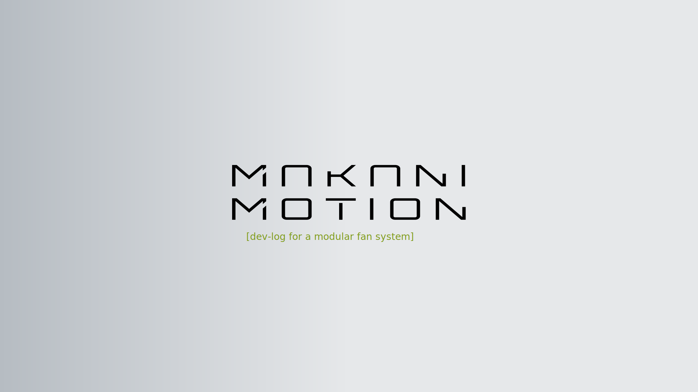
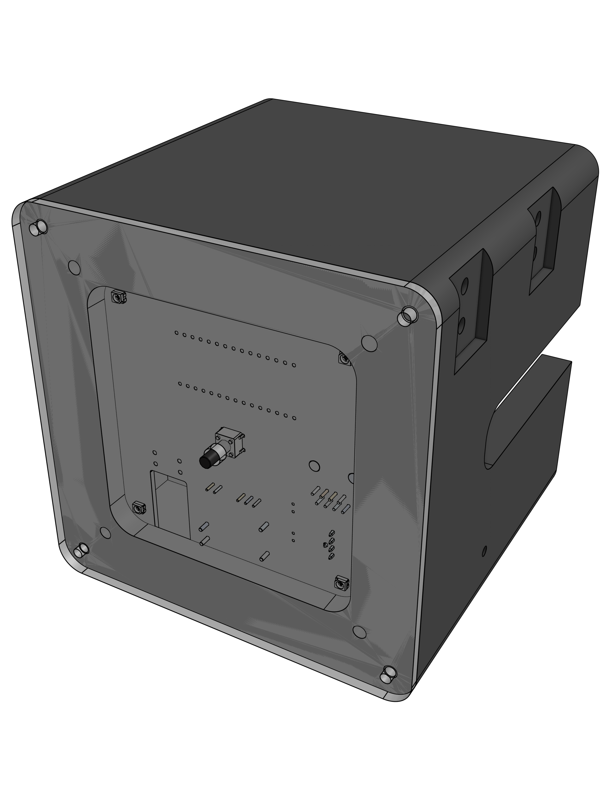
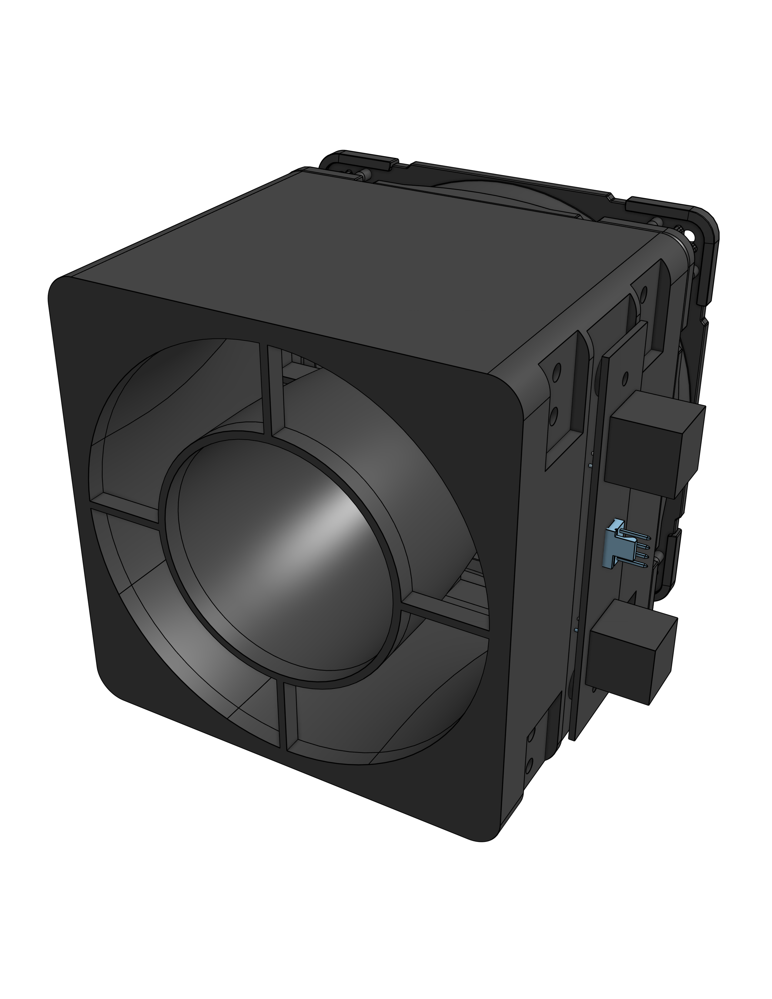
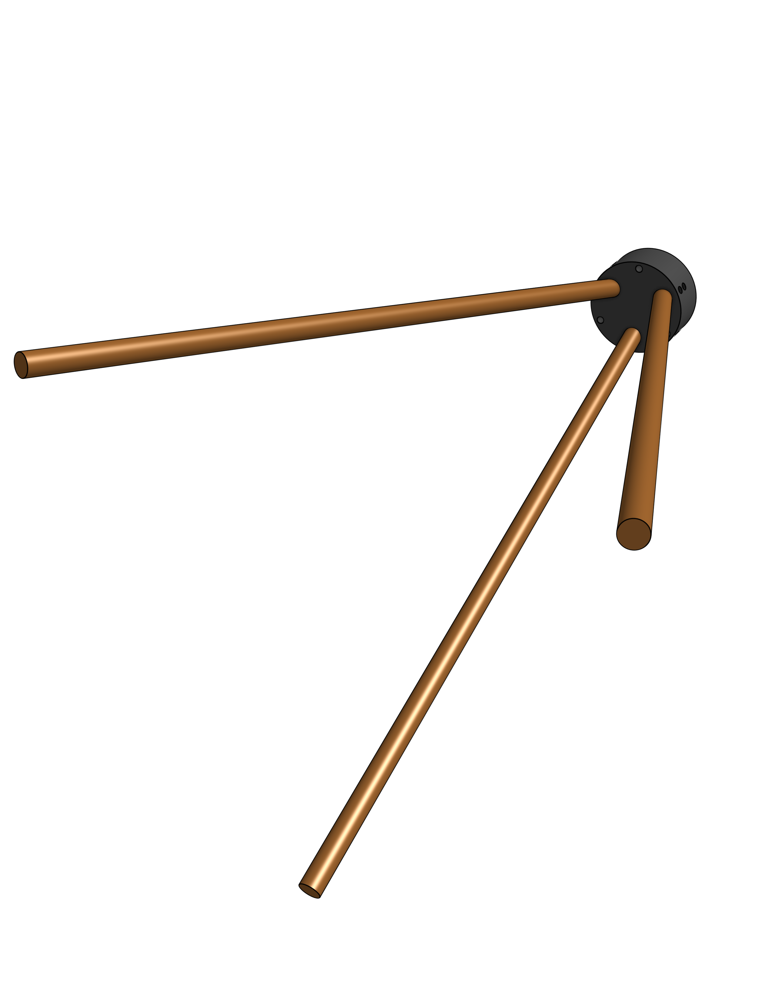
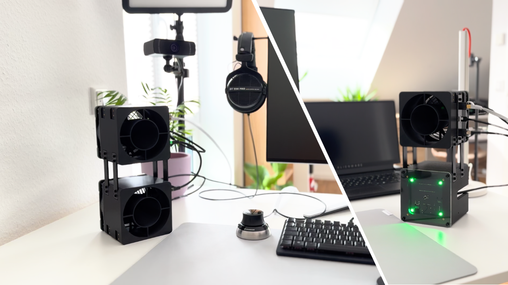
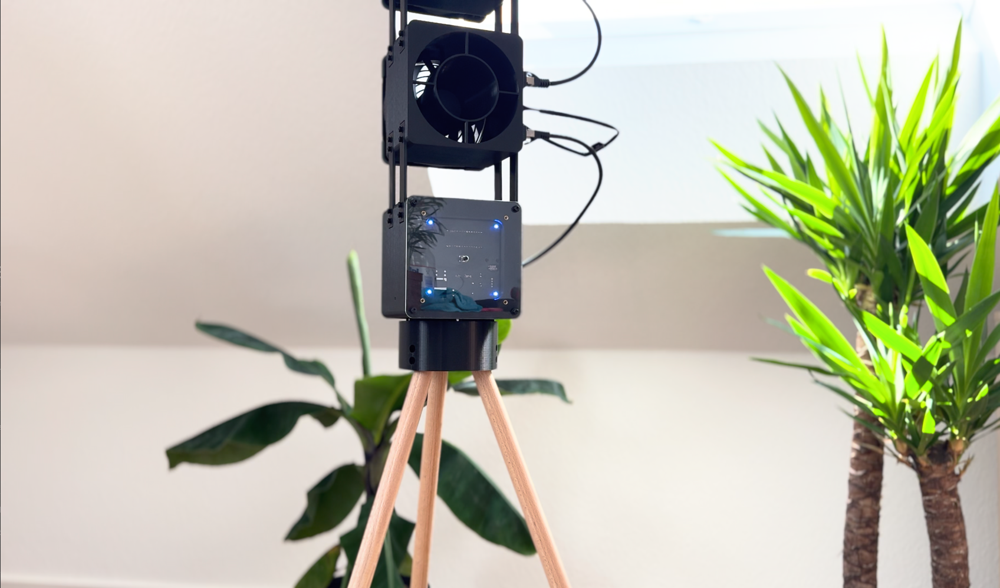

<p align="center">
  
</p>

# MakaniMotion MM-Fan GEN 1

A modular DIY fan platform.

## Table of Contents

- [Overview](#overview)
- [Motivation](#motivation)
- [Modules](#modules)
  - [MM-BASE](#mm-base)
  - [MM-AIR](#mm-air)
  - [MM-TRI](#mm-tri)
- [System Parts](#system-parts)
- [Build Configurations](#build-configurations)
  - [Table Version](#table-version)
  - [Stand Version](#stand-version)
- [Project Status](#project-status)
- [License / Usage](#license--usage)

## Overview

MakaniMotion MM-Fan GEN 1 is a modular DIY fan platform built around interchangeable modules.

The system can be assembled in different configurations and combines PC fan hardware, 3D-printed mechanical parts and a simple control interface.

## Motivation

The goal of this project is to develop a fan system that is quiet, modular, energy-efficient and visually aesthetic.

The design is based on high-performance PC / gaming fans. These fans are developed in a highly competitive market and are therefore typically optimized for low noise, low power consumption and high airflow.

The main challenge of MakaniMotion MM-Fan GEN 1 is to adapt these properties to the use case of a room fan. Instead of only moving air through a PC case, radiator or filter, the system is designed to create a more focused and usable airflow for indoor use.

## Modules

MakaniMotion MM-Fan GEN 1 is built around three main modules. Each module has a dedicated function and can be combined with the other modules depending on the desired build configuration.

### MM-BASE

<p align="left">
  
</p>

**MM-BASE** is the base and control module of the system.

It provides the main electrical control interface, power distribution and user interface for the fan setup. The GEN 1 main PCBA uses an Arduino Nano to keep the project easy to reproduce.

MM-BASE is intended to be powered from a suitable 5 V USB power bank. The enclosure is designed to fit smaller power banks inside the module, allowing the system to be used as a battery-powered device without using a custom battery pack.

In the current GEN 1 prototype, MM-BASE may not work directly with all USB chargers. A power source with an active/default 5 V output is required.

| Item | Description |
|---|---|
| Module name | MM-BASE |
| Main PCBA | mm-main-pcba-gen1-reva |
| Controller | Arduino Nano |
| Power input | 5 V |
| Recommended power source | Suitable USB power bank |
| Power source requirement | Active/default 5 V output |
| Power bank integration | Enclosure space for smaller power banks |
| Power stage | 10 W DC/DC converter |
| Supported MM-AIR modules | Up to 5 MM-AIR modules in the current setup |
| HMI | One push button for PWM level selection |
| Status indication | Four RGB LEDs indicate the selected PWM level using different colors |
| Design goal | Easy to build, easy to understand and suitable for DIY reproduction |

### MM-AIR

<p align="left">
  
</p>

**MM-AIR** is the fan / airflow module of the system.

It uses a Noctua NF-A12x25 PWM 120 mm fan, selected for its low noise level, low power consumption and high airflow performance.

The fan is mounted to a 3D-printed shroud that reduces the outlet cross-section. This helps increase air velocity and creates a more focused airflow for use as a room fan.

An interface PCB is mounted on the side of the module. The **mm-interface-pcba-gen1-reva** connects MM-AIR to the daisy-chain system and provides two RJ45 sockets and one PC fan header.

| Item | Description |
|---|---|
| Module name | MM-AIR |
| Fan | Noctua NF-A12x25 PWM |
| Fan size | 120 mm |
| Fan control | PWM |
| Interface PCBA | mm-interface-pcba-gen1-reva |
| System connectors | 2 × RJ45 sockets for daisy-chain connection |
| Fan connector | 1 × PC fan header |
| Mechanical design | 3D-printed shroud |
| Airflow concept | Reduced outlet cross-section to increase air velocity |
| Design goal | Quiet operation with focused, usable airflow |

### MM-TRI

<p align="left">
  
</p>

**MM-TRI** is the tripod module for the free-standing build configuration.

It provides a simple and stable three-leg support structure for the system.

The three-leg design avoids mechanical overconstraint and helps the fan stand securely on uneven surfaces.

The module is intentionally kept simple and minimal while still maintaining an elegant appearance. In the current version, MM-TRI is attached to MM-BASE using three screws, making it easy to switch between the table version and the free-standing configuration.

| Item | Description |
|---|---|
| Module name | MM-TRI |
| Module type | Tripod module |
| Mechanical concept | Three-leg support structure to avoid mechanical overconstraint |
| Mounting interface | Attached to MM-BASE using a single screw |
| Required for | Stand version |
| Design goal | Simple, stable and elegant free-standing support |

## System Parts

The system also includes physical parts that belong to the overall GEN 1 system but are not assigned to a single module.

- **MM-CONNECT** – mechanical connection element
- **Connection Cables** – The connection cables are based on RJ45, but they are not used for Ethernet networking. They are repurposed as system connection cables for power and signals between modules.

## Build Configurations

MakaniMotion MM-Fan GEN 1 can typically be assembled in two main configurations:

### Table Version

The table version is designed to be placed on a desk or similar surface.

<p align="left">
  
</p>

In this configuration, the **MM-TRI** tripod module is not required.

Because the modules are connected by cables, the physical layout can be adapted to different use cases and desk setups.

### Stand Version

The stand version is designed as a free-standing fan setup.

<p align="left">
  
</p>

In this configuration, the **MM-TRI** tripod module is required.

## Project Status

Prototype / work in progress.

This repository contains the first product generation:

```text
MakaniMotion MM-Fan GEN 1
```

Module revisions within this generation are tracked separately, for example:

```text
MM-Base GEN 1 Rev A
MM-Air GEN 1 Rev A
MM-TRI GEN 1 Rev A
```

This project is a DIY development project and is not a certified consumer product.

No CE declaration, conformity assessment or safety certification.

Anyone building hardware based on this project does so at their own risk and is responsible for safe assembly and operation.

## License / Usage

This project is source-available for private and non-commercial use only.

Private individuals may view, download, build and modify the project files for personal use.

Non-commercial sharing or uploading of modified project files is allowed if MakaniMotion is clearly credited as the original source and this license remains included.

Commercial use is not permitted. This includes use by companies, commercial organizations, paid services, commercial product development, manufacturing for commercial purposes, or distributing physical devices, kits, parts or assemblies based on this project.

For details, see [`LICENSE.md`](LICENSE.md).

© MakaniMotion. All rights reserved unless otherwise stated.